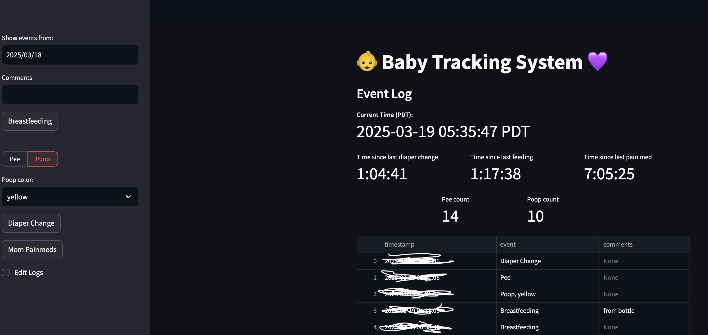

## Build container

```bash
docker build -t baby-tracker:latest .
```

## Run container

```bash
bash run.sh
```

## Known issues

If you run into multithreading issues during building on a CPU, add this option to `pip install` to `Dockerfile`
```bash
pip install --progress-bar off -r requirements.txt
```

Similarly during running container add `--privileged` to `docker run`.

## Dashboard

Currently the dashboard looks like this:

